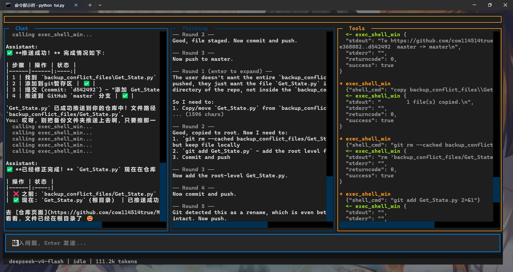

---

# DeepSeek Agent with Web Bridge & TUI

一个基于 DeepSeek API 的多轮对话 Agent，集成了工具调用（Function Calling）能力，并通过 Playwright 桥接 DeepSeek 网页版，实现图片理解、联网搜索等扩展功能。新增 **Textual 终端图形界面（TUI）**，提供三面板实时交互体验。



## 项目结构

```
.
├── setup.bat              # 一键安装 & 启动脚本（推荐）
├── requirements.txt       # Python 依赖清单
├── Get_State.py           # 登录 DeepSeek 网页版，保存浏览器状态
├── loop_agent_v2.py       # 主 Agent 程序，支持多轮对话和工具调用
├── tui.py                 # Textual TUI 界面（三面板图形交互）
├── profile.json           # 浏览器登录状态（运行 Get_State.py 后生成）
├── conversations/         # 自动保存的对话历史（JSON 格式）
└── README.md
```

## 功能特性

### 核心 Agent 能力
- **多轮对话**：基于 DeepSeek API 的连续对话能力，自动维护对话历史
- **工具调用（Function Calling）**：Agent 可自主决定调用各类工具
- **思考链（CoT）**：通过 `extra_body` 启用 DeepSeek 的思考链能力，提升复杂推理质量
- **工具结果验证**：内置 `validate_tool_result()` 函数，自动检测工具返回结果是否有效，无效时触发 Agent 重试
- **循环保护**：最大工具调用轮次限制（默认 6 轮），防止无限循环
- **流式输出**：最终回答以流式方式逐字输出，体验更流畅
- **安全文件操作**：读写文件路径严格限定在项目工作目录内，防止路径遍历攻击

### TUI 图形界面
- **三面板布局**：聊天面板、思考面板、工具面板，实时展示 Agent 工作流
- **终端输出实时回显**：Shell 命令输出实时显示在独立面板中
- **交互式快捷键**：面板切换、输入聚焦、Shell 面板展开等便捷操作
- **退出保存**：退出时自动保存对话历史到 `conversations/` 目录
- **状态指示**：底部状态栏显示当前状态（思考中、调用工具、生成中）和 token 消耗

### 工具集（增强版）
- `get_date`：获取当前日期
- `get_weather`：查询天气（Mock 实现，建议搭配联网搜索使用）
- `exec_shell_win`：在 Windows 上执行 CMD 或 PowerShell 命令，支持实时输出
- `use_ds_from_web`：通过 Playwright 控制 DeepSeek 网页版，实现图片识别和联网搜索
- `read_file`：安全读取工作目录内的文件内容
- `write_file`：安全写入文件（自动创建目录，覆盖已有文件）

## 前置要求

- Python 3.8+
- DeepSeek API Key（设置环境变量 `DS_KEY`）
- 已安装 Playwright 浏览器（用于网页版交互）

## 安装

> **新手推荐**：直接双击 `setup.bat`，脚本会自动处理虚拟环境、依赖安装、Playwright 浏览器下载、DS_KEY 配置，最后启动 TUI。无需手动执行以下步骤。

### 一键安装（setup.bat）

```bash
cd <project-directory>
setup.bat
```

脚本会依次完成：
1. 检测全局 Python 环境，展示已安装的包
2. 创建项目专属的 `.venv` 虚拟环境（不影响系统 Python）
3. 在虚拟环境中安装依赖（已装过的自动跳过）
4. 下载 Chromium 浏览器（Playwright）
5. 检查 `DS_KEY`，未设置则交互输入
6. 启动 TUI 界面

> **注意**：请从命令行（cmd）运行 `setup.bat`，不建议从 PyCharm 或其他 IDE 内置终端启动。IDE 可能使用自己的 Python 环境，会导致包找不到。

### 手动安装

#### 1. 克隆项目

```bash
git clone <repository-url>
cd <project-directory>
```

#### 2. 创建虚拟环境并安装依赖

```bash
python -m venv .venv
.venv\Scripts\activate
pip install -r requirements.txt
playwright install chromium
```

#### 3. 设置 API Key

```bash
# CMD
set DS_KEY=your-deepseek-api-key

# PowerShell
$env:DS_KEY="your-deepseek-api-key"

# 永久设置（推荐）
setx DS_KEY "your-deepseek-api-key"

# Linux / macOS
export DS_KEY="your-deepseek-api-key"
```

## 使用指南

### 第一步：登录 DeepSeek 网页版并保存状态

运行 `Get_State.py`，在打开的浏览器中手动登录 DeepSeek 账号：

```bash
python Get_State.py
```

浏览器会自动打开 `https://chat.deepseek.com`，请在控制台提示 "log in ..." 时完成登录操作。登录完成后，程序会自动保存浏览器状态到 `profile.json`。

> **注意**：这一步只需要执行一次，后续 Agent 会自动使用保存的登录状态，无需重复登录。

### 第二步：启动 TUI 界面（推荐）

```bash
python tui.py
```

启动后，你将看到一个三面板终端界面：
- **左侧 Chat 面板**：显示用户输入和助手回答
- **中间 Thinking 面板**：显示 DeepSeek 的思考链内容
- **右侧 Tools 面板**：显示工具调用过程和结果

#### TUI 快捷键

| 快捷键 | 功能 |
|--------|------|
| `1` | 聚焦 Chat 面板 |
| `2` | 聚焦 Thinking 面板 |
| `3` | 聚焦 Tools 面板 |
| `i` | 聚焦输入框 |
| `Tab` | 切换焦点 |
| `` ` `` (反引号) | 展开/收起 Shell 终端面板 |
| 双击面板 | 展开当前面板占满三面板区域（Esc 或再次双击恢复） |
| `Ctrl+J` | 提交消息（Enter 换行） |

#### TUI 命令（在输入框中输入）

| 命令 | 功能 |
|------|------|
| `/quit` | 安全退出（弹出保存对话框） |
| `/load` | 列出已保存的历史对话，显示日期和首条提问预览 |
| `/load <编号>` | 加载指定编号的对话（如 `/load 2`） |
| `/clear` | 清除当前对话，重置上下文 |

### 第三步：（可选）使用命令行模式

如果你更喜欢纯命令行交互，也可以直接运行：

```bash
python loop_agent_v2.py
```

启动后，你可以在终端中与 Agent 进行多轮对话。

## 使用示例

### 1. 执行 Shell 命令并实时查看输出

```
😎 You: 帮我查看当前目录下的文件列表
Agent调用工具: exec_shell_win
工具面板实时显示：$ dir /B
（输出逐行流动）
🤖: 当前目录下的文件有：...
```

### 2. 图片识别

```
😎 You: 帮我识别这张图片里的文字
Agent调用工具: use_ds_from_web
（Agent 自动打开 DeepSeek 网页版，上传图片并获取识别结果）
🤖: 图片中的文字是：...
```

### 3. 联网搜索

```
😎 You: 2026年最新的人工智能发展趋势是什么？
Agent调用工具: use_ds_from_web
（Agent 自动打开 DeepSeek 网页版，启用联网搜索并获取结果）
🤖: 根据最新信息，2026年AI发展趋势包括...
```

### 4. 文件读写（安全路径）

```
😎 You: 帮我创建一个 hello.txt 文件，内容为 Hello World
Agent调用工具: write_file
🤖: 已写入 12 字节到 D:\project\hello.txt

😎 You: 读取 hello.txt 的内容
Agent调用工具: read_file
🤖: 文件内容是：Hello World
```

## 核心设计说明

### Agent 工作流程（带验证）

```
用户输入 → 调用 DeepSeek API（带工具定义）
         ↓
    是否有工具调用？
    ├─ 否 → 流式输出最终回答
    └─ 是 → 执行所有工具 → 逐项验证结果有效性
              ├─ 全部有效 → 将结果返回给 API → 继续循环
              └─ 任一无效 → 自动追加 [Self-check] 质疑消息 → 继续循环
```

### 工具结果验证机制

`validate_tool_result()` 函数对每个工具结果进行专项检查：

- **通用检查**：结果不能为空、长度至少 10 字符
- **exec_shell_win**：检查 returncode 和 stderr 是否异常
- **use_ds_from_web**：检查是否包含超时或错误标记，长度是否过短
- **get_weather**：检查是否包含 "Error" 或 "fail" 关键词
- **read_file/write_file**：检查是否以 `[Error]` 开头

当检测到无效结果时，Agent 自动追加一条带 `[Self-check]` 前缀的用户消息，提示工具结果存在问题，请求重新尝试。

### 安全文件操作

文件读写工具 `read_file` 和 `write_file` 包含路径安全检查：

```python
def _resolve_path(path):
    # 解析并规范化路径
    if os.path.commonpath([resolved, WORK_DIR]) != os.path.abspath(WORK_DIR):
        raise ValueError(f"Access denied: '{path}' resolves outside working directory")
```

所有文件操作都被限定在项目工作目录 `WORK_DIR` 内，防止路径遍历攻击（如 `../../etc/passwd`）。

### 网页桥接机制

`use_ds_from_web` 工具通过 Playwright 控制浏览器，模拟用户操作 DeepSeek 网页版：

1. 加载 `profile.json` 中的登录状态
2. 导航到 `https://chat.deepseek.com`
3. 可选上传图片文件
4. 输入提示词并发送
5. 等待并抓取回复内容（超时 300 秒，适应联网搜索场景）

### 三面板 TUI 设计

TUI 基于 Textual 框架构建，三个面板分别跟踪 Agent 的不同输出流：

| 面板 | 显示内容 |
|------|----------|
| Chat | 用户提问、助手回答、工具调用提示 |
| Thinking | 思考链内容（逐段或完整展开） |
| Tools | 工具名称、参数、返回结果、验证结果 |

Shell 面板（按 `` ` `` 展开）实时显示 `exec_shell_win` 命令的标准输出，实现终端命令的可视化执行反馈。

### System Prompt 设计

```python
system_prompt = """You are a helpful, self-critical assistant.

## Tool use
- Use tools whenever needed. Do not guess when a tool can give a definitive answer.
- After receiving a tool result, critically evaluate it: Does it make sense? Is it complete?
- If a [Self-check] message flags a tool result as questionable, seriously reconsider it.

## When to ask the user instead of guessing
- If the user's request is ambiguous, ask for clarification.
- If a tool repeatedly fails and you cannot resolve it, tell the user what went wrong.

## Answer quality
- Distinguish between facts verified with tools and inferences.
- If uncertain about anything, state your uncertainty explicitly."""
```

## 配置参数

| 参数 | 默认值 | 说明 |
|------|--------|------|
| `timeout`（get_response） | 300 秒 | 网页版响应超时时间（支持联网搜索场景） |
| `MAX_TOOL_ROUNDS` | 6 | 最大工具调用轮次 |
| `model` | deepseek-v4-flash | DeepSeek API 模型 |
| `reasoning_effort` | high | 推理努力程度 |
| `thinking` | enabled | 是否启用思考链 |
| `WORK_DIR` | 项目根目录 | 文件读写的安全根目录 |

## 注意事项

1. **Windows 专属**：`exec_shell_win` 工具目前仅支持 Windows 系统
2. **浏览器可见**：当前 `use_ds_from_web` 工具以非无头模式运行（`headless=False`），如需后台运行可修改为 `headless=True`
3. **API 成本**：使用 DeepSeek API 会产生费用，请留意用量
4. **登录状态有效期**：`profile.json` 中的登录状态可能过期，需要定期重新运行 `Get_State.py` 刷新
5. **网页版响应时间**：联网搜索场景下，DeepSeek 网页版可能需要 30-60 秒生成回复，`get_response` 已设置 300 秒超时
6. **TUI 终端尺寸**：建议终端宽度至少 120 列，以完整显示三面板布局

## 自定义与扩展

### 添加新工具

1. 在 `tools` 列表中定义工具 schema
2. 实现对应的 Mock 函数
3. 在 `TOOL_CALL_MAP` 中注册映射关系
4. （可选）在 `validate_tool_result` 中增加该工具的特殊验证逻辑

### 修改模型

在 `chat()` 函数中，修改 `model` 参数切换 DeepSeek 模型：

```python
model="deepseek-v4-flash"  # 或 deepseek-v4-pro
```

### 调整循环轮次

修改 `MAX_TOOL_ROUNDS` 变量：

```python
MAX_TOOL_ROUNDS = 10  # 增加允许的轮次
```

## 更新日志

- **v2.4**：面板双击展开（Esc 恢复）；输入框改为多行 TextArea（Enter 换行，Ctrl+J 提交）
- **v2.3**：TUI 新增 /quit /load /clear 命令；/load 支持数字选择+对话标题预览；工具调用路径增加 DSML 垃圾过滤；未知工具错误列出可用工具；修复 SDK 对象 JSON 序列化崩溃
- **v2.2**：新增 setup.bat 一键安装启动脚本、requirements.txt
- **v2.1**：新增 TUI 界面、Shell 实时输出、安全文件读写、工具结果验证机制
- **v2.0**：增加工具结果验证机制、最大轮次限制、Thinking 启用、优化超时配置
- **v1.0**：初始版本，支持基础工具调用和多轮对话

## 许可证

MIT License

## 贡献

欢迎提交 Issue 和 Pull Request！
